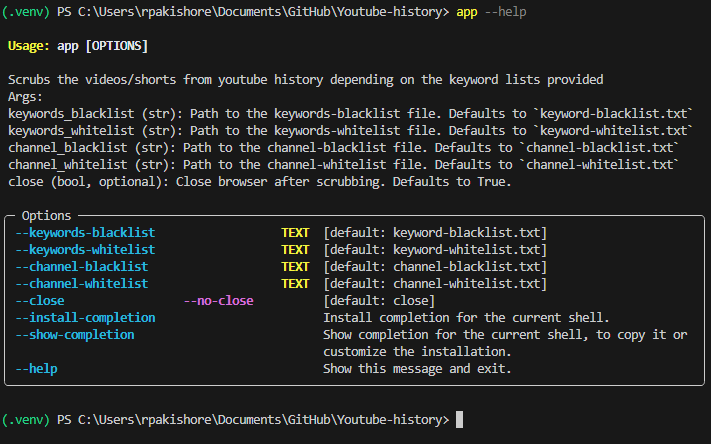

<!--- Heading --->
<div align="center">
  
  <h1>Youtube Scrubber</h1>
  <p>
    Selectively scrubs videos and shorts from your youtube history to better the youtube recommendation algorithm
  </p>
<h4>
    <a href="https://github.com/rpakishore/Youtube-history">Documentation</a>
  <span> · </span>
    <a href="https://github.com/rpakishore/Youtube-history/issues/">Report Bug</a>
  <span> · </span>
    <a href="https://github.com/rpakishore/Youtube-history/issues/">Request Feature</a>
  </h4>
</div>
<br />


<!-- Table of Contents -->
<h2>Table of Contents</h2>

- [1. About the Project](#1-about-the-project)
  - [1.1. Screenshots](#11-screenshots)
  - [1.2. Features](#12-features)
- [2. Getting Started](#2-getting-started)
  - [2.1. Prerequisites](#21-prerequisites)
  - [2.2. Dependencies](#22-dependencies)
  - [2.3. Installation](#23-installation)
    - [2.3.1. Production](#231-production)
    - [2.3.2. Development](#232-development)
- [3. Usage](#3-usage)
- [4. Roadmap](#4-roadmap)
- [5. FAQ](#5-faq)
- [6. License](#6-license)
- [7. Contact](#7-contact)
- [8. Acknowledgements](#8-acknowledgements)

<!-- About the Project -->
## 1. About the Project
<!-- Screenshots -->
### 1.1. Screenshots



<!-- Features -->
### 1.2. Features

- Can selectively scrub videos
- Can scrub some shorts

<!-- Getting Started -->
## 2. Getting Started

<!-- Prerequisites -->
### 2.1. Prerequisites

Google Chrome Browser (Regular not `dev` or `beta`), with your google account already logged in.

Any combination of the following `.txt` file with the list of keywords for scrubbing. 

| Example filenames| Use |
| -- | -- |
| `channel-blacklist.txt` | This will delete videos from channels names in this file | 
| `channel-whitelist.txt` | This will retain videos from channels names in this file | 
| `keyword-blacklist.txt` | This will delete videos with matching keywords | 
| `keyword-whitelist.txt` | This will retain videos with matching keywords | 

### 2.2. Dependencies

Create the virutual environment and install flit

```bash

git clone https://github.com/rpakishore/Youtube-history.git

cd  Youtube-history

python -m venv .venv

.venv\Scripts\activate.bat

pip install flit
```

<!-- Installation -->
### 2.3. Installation

#### 2.3.1. Production

Install with flit

```bash
  flit install --deps production
```

#### 2.3.2. Development

Install with flit

```bash
  flit install --pth-file
```

<!-- Usage -->
## 3. Usage

For default use, just the command `app` can be used. use `--help` to see methods and acceptable inputs

```bash
  app --help
```

<!-- Roadmap -->
## 4. Roadmap

- [x] Scrub Videos
- [ ] Fully scrub shorts
- [ ] Add ability to load more history and restart scrubbing
- [x] Add `whitelist.txt`
- [ ] Tests

<!-- FAQ -->
## 5. FAQ

- Why this project?
  - Sometimes, I find myself binge-watching random entertainment videos on YouTube just to combat boredom. However, this negatively affects the YouTube algorithm, resulting in a flood of similar videos in my recommendations. This creates a vicious cycle. By using this solution, I can maintain a clean browsing history, avoid irrelevant recommendations, and ensure that I preserve the high-quality content I enjoy.

<!-- License -->
## 6. License

See LICENSE.txt for more information.

<!-- Contact -->
## 7. Contact

Arun Kishore - [@rpakishore](mailto:pypi@rpakishore.co.in)

Project Link: [https://github.com/rpakishore/Youtube-history](https://github.com/rpakishore/Youtube-history)

<!-- Acknowledgments -->
## 8. Acknowledgements

- [Awesome README Template](https://github.com/Louis3797/awesome-readme-template/blob/main/README-WITHOUT-EMOJI.md)
- [Banner Maker](https://banner.godori.dev/)
- [Shields.io](https://shields.io/)
- [Carbon](https://carbon.now.sh/)